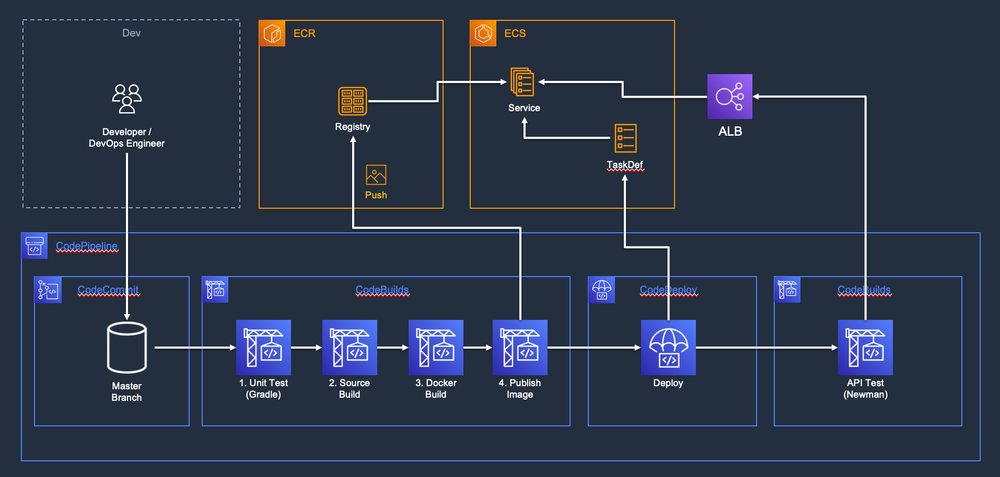
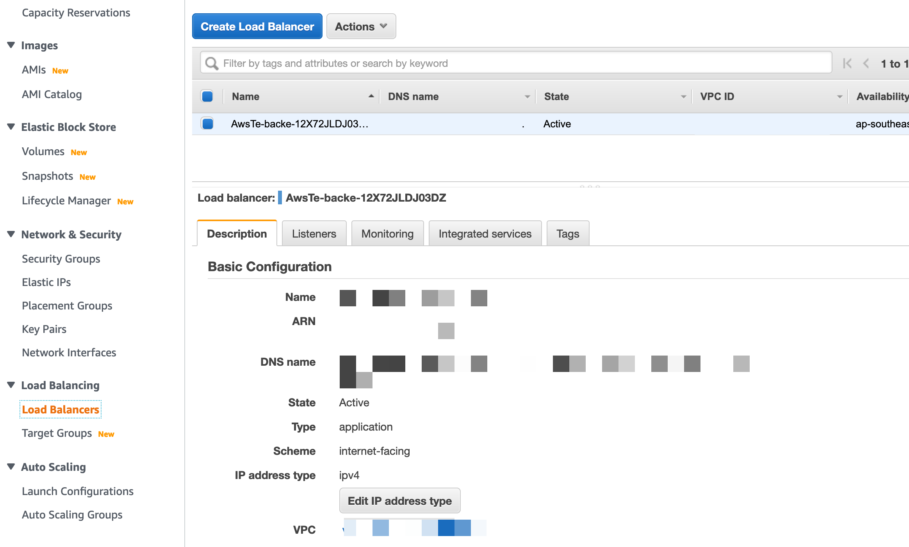

# AWS Test Automation for DevOps 
빠르고 유연한 DevOps를 적용함에 있어 자연스럽게 함께 고려해야하는 것 중 하나가 테스트 자동화입니다. 이 샘플 코드는 테스트 자동화를 통해 DevOps를 고도화 하기 위해서 AWS의 CI/CD에서 테스트 자동화를 적용하기 위한 방안과 패턴을 공유하고 실습을 통해서 직접 테스트 자동화를 구현해볼 수 있습니다. 

## Sample code 설명
이 샘플 코드는 적은 노력으로 인프라와 샘플 코드를 배포하기 위해서 cdk2(Typescript)로 작성되어 적용할 수 있습니다. 

# Architecture
## 서비스 환경

- Amazon S3 - Amazon CloudFront 로 호스팅하는 Frontend
    - React로 구현되어 있어 CodePipeline에서 build하여 S3로 배포
- ALB - ECS로 구성된 Backend API
    - Spring boot로 구현되어 있고 Internet facing ALB를 통해 API 제공 
    - CodePipeline에서 build하고 ECR에 Image를 push하여 배포

## CI/CD
### Common
- Developer/Engineer가 CodeCommit에 Source를 Push하면 CodePipeline이 시작된다.
- Static 자원을 배포하는 Frontend pipeline과 API를 serve하는 Backend pipeline이 각각 구성된다. 

### Backend

- CodeCommit에 새로운 코드가 push되면 Build stage가 실행된다. 
- Build stage는 여러 task를 실행하는데 먼저 Gradle로 Unit Test를 한다. 
    - 이때 Test가 실패하면 배포가 중단된다.
- Unit Test가 성공하면 Source를 Build하고 Container 이미지로 Build한다. 
- Build된 이미지를 ECR에 Push한다. 
- Build Stage에서 Push한 Image를 가지고 Deploy stage의 CodeDeploy에서 Deploy한다. 
- Deploy가 완료되면 Test stage의 CodeBuild에서 API Test를 실행하고 결과를 Report로 작성한다.

### Frontend

- CodeCommit에 새로운 코드가 push되면 Build stage가 실행된다. 
- Build stage는 소스를 Build한다. 
- Build Stage가 완료되면 Deploy Stage가 실행 되는데 이때 Deploy stage는 CodeBuild로 구성되어있다.
- Deploy Stage에서는 Build된 artifact를 s3로 전송하고 CloudFront를 invalidate한다.
- Deploy가 완료되면 Test Stage에서 Device Farm을 통해서 원격에서 UI Test를 한다.

# Deploy
## CDK Build & Deploy
1. 소스를 받고 [bin/aws-test-automation-devops-cdk.ts](bin/aws-test-automation-devops-cdk.ts)에 env(account, region)를 설정한다.

2. `cdk deploy`를 통해서 설정한 account, region에 배포한다. 

## Device Farm 생성
AWS Device Farm은 Frontend의 UI를 테스트하는 데 사용됩니다. 
그러나 현재 CDK로는 생성할 수 없는 리소스이며, Device Farm은 CDK 배포 후 다음과 같이 수동으로 생성됩니다.

1. 먼저 AWS Console 에서 Device Farm을 검색해 서비스를 찾고 `Desktop Browser Testing - Projects`에서 새 프로젝트 생성.

2. Project Name만 입력하면 생성 가능

3. Script를 통한 UI Test를 진행하면 아래처럼 세션이 생기고 선택해서 테스트 한 내용 확인

4. UI Test 한 내용은 Video를 통해서 확인 가능

## 환경 수동 수정
CDK 배포가 완료된 이후에 몇가지 직접 환경 수정이 필요하다. 
1. 테스트 스크립트에 직접 테스트할 Backend Endpoint, CloudFront URL 필요
2. 배포 스크립트에 포함된 배포시 Invalidation 하기 위한 CloudFront Distributions ID
3. Frontend page에서 호출하는 Backend API URL

### Check deployed environment
1. Backend ALB DNS
    
    * `EC2 > Load Balnacers` 에서 생성된 ALB를 선택하여 DNS name을 확인

2. Frontend DNS & CloudFront distibution ID
    
    1. `CloudFront > Distributions`에서 생성된 Distribution을 선택
    
    2. 상단 `Distribution ID`와 `Distribution domain name`을 확인

### Back-end
1. Test 자동화 위한 script json 수정
    
    
    1. `CodeCommit > Repositories` 에서 생성된 Repository 선택
    
    
    2. `Demogo-User.postman_collection.json` file 선택
    
    
    3. `[[ALB_URL]]`과 `[[REGION]]`값을 생성된 값으로 변경한다.
    
    
    4. 아래에서 Author name과 Email address를 입력하고 Commit changes를 선택하여 소스를 변경한다.

2. ECS Desire count 수정
    * 방법

### Front-end
1. API 호출 URL 변경
    
    * `Codecommit > Repositories > codecommit-demogo-frontend-user` repository에서 /src/App.js를 선택한다.
    * `[[ALB_URL]]`과 `[[REGION]]`값을 생성된 값으로 변경한다.
    
2. CloudFront Invalidate 변경
    
    * 동일한 Repository에서 `build_deploy.yml`을 선택한다.
    * CloudFront의 Distribution ID로 `[[DIST_ID]]`를 대체한다

3. Test 자동화 위한 script URL 변경
    
    * 동일한 Repository에서 `test-ui-devicefarm.js`을 선택한다.
    * 생성한 Device Farm ARN과 TEST_URL을 각각 `[[DEVICE_FARM_ARN]]`, `[[TEST_URL]]`를 대체한다

### 참고. CDK 간단 명령어 설명

* `npm run build`   compile typescript to js
* `npm run watch`   watch for changes and compile
* `npm run test`    perform the jest unit tests
* `cdk deploy`      deploy this stack to your default AWS account/region
* `cdk diff`        compare deployed stack with current state
* `cdk synth`       emits the synthesized CloudFormation template

## Security

See [CONTRIBUTING](CONTRIBUTING.md#security-issue-notifications) for more information.

## License

This library is licensed under the MIT-0 License. See the LICENSE file.

