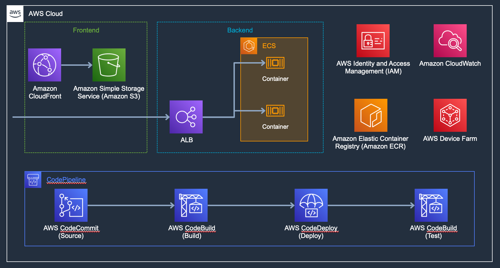
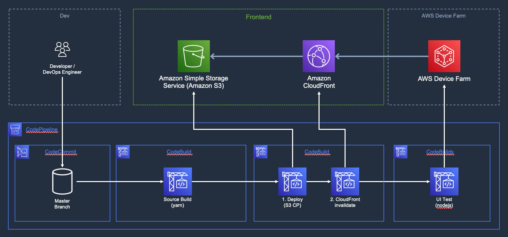
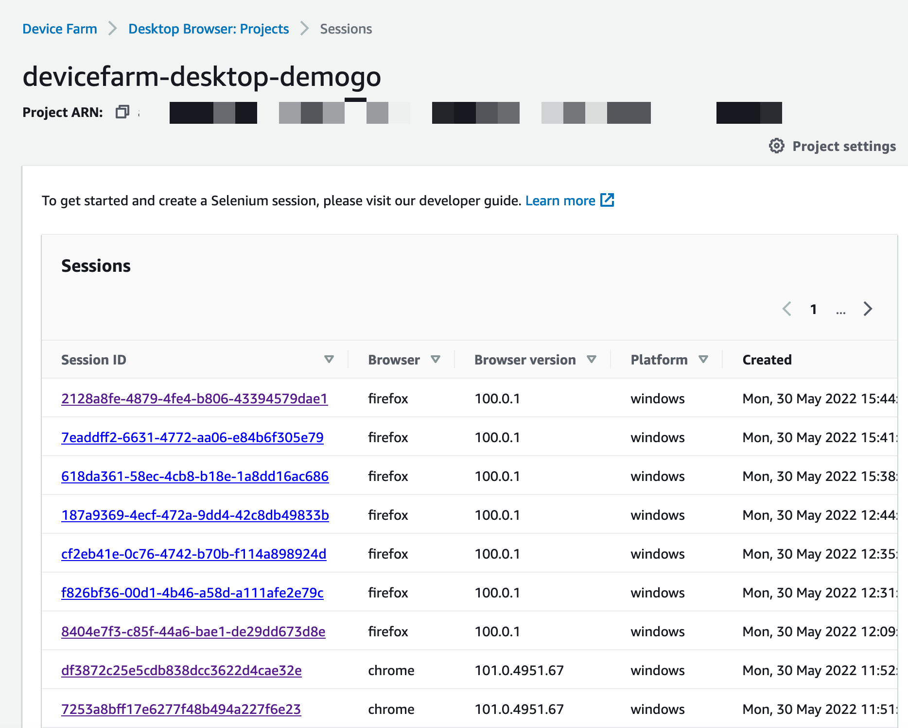
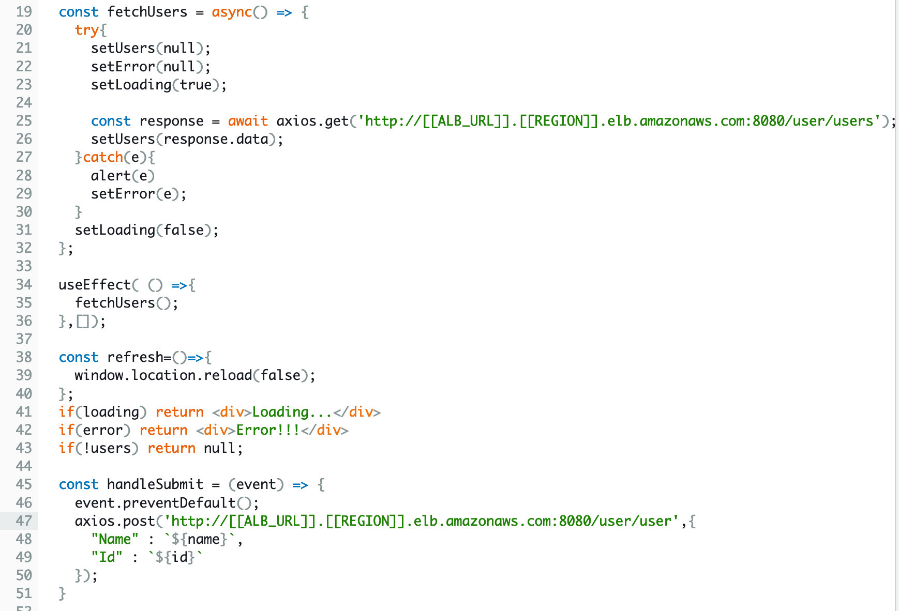
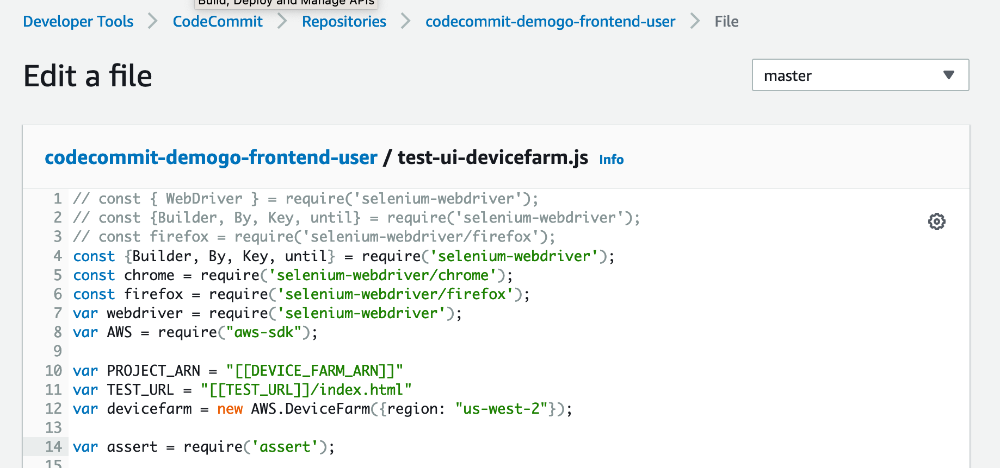

# AWS Test Automation for DevOps 
In most cases, test automation is needed for Agile in DevOps. This sample code shares methods and patterns for applying test automation in CI/CD of AWS in order to transform DevOps through test automation. With this sample, you can implement test automation directly through practice.

## Sample code
It is written in cdk2 (Typescript) and can be applied to deploy infrastructure with little effort.

# Architecture
## Service Environment

- Amazon S3 - Amazon CloudFront
    - Implemented in React, build in CodePipeline and deploy to S3
    
- ALB - ECS
  - Implemented with Spring boot and provide API through ALB
  - Built in CodePipeline and deployed by pushing Image to ECR

## CI/CD
### Common
- CodePipeline started with Developer/Engineer pushes Source to CodeCommit.
- The Frontend pipeline is for static resources, the Backend pipeline is for API Backend.

### Backend

- When new code is pushed to CodeCommit, the build stage is executed.
- The build stage is executed with several tasks. First, unit tests are performed with Gradle.
    - If the test fails, the distribution is stopped.

- If the unit test succeeds, build the source as a container image.
- Push the image to ECR. 
- In Build stage, deploy the image to CodeDeploy(Deploy stage).
- When deployment is complete, API Test is executed in CodeBuild(Test stage) and the report will be come out form the result. 

### Frontend

- Similarly, when new code is pushed to CodeCommit, the Build stage executes.
- The source will be built in the Build stage.
- When the build stage completes, the deploy stage will execute. At this time, the deploy stage is composed of CodeBuild.
- In the deploy Stage, the built artifacts are sent to s3 and CloudFront is invalidated.
- When the deployment is complete, the UI test is remotely performed by Device Farm in the Test stage.

# Deploy
## CDK Build & Deploy
1. Get the source and set env(account, region) in [bin/aws-test-automation-for-devops-using-aws-cdk.ts](bin/aws-test-automation-for-devops-using-aws-cdk.ts)

2. Set the bucket name to which frontend static resources will be distributed in [lib/aws-test-automation-for-devops-using-aws-cdk-stack.ts](lib/aws-test-automation-for-devops-using-aws-cdk-stack.ts).
  
  
3. Execute the cdk deploy command to deploy to the account and region previously set. 
  

## Create new Device Farm project
AWS Device Farm is used to test the UI of the Frontend.
However, it is a resource that cannot be created with the current CDK, and Device Farm is created manually as follows after CDK distribution.

1. First, search Device Farm in the AWS Console to find the service and create a new project in `Desktop Browser Testing - Projects`.

2. You can create by entering the Project Name.

3. If you proceed with the UI Test, a session is created as shown below, and you can select and check the test contents.

4. The UI test result can be checked through the video.

## Manually modify the environment.
After the CDK deployment , some environment modifications are required.
1. Requires Backend Endpoint/CloudFront URL to Test in test script
2. CloudFront Distributions ID in distribution script
3. Backend API URL, requested by Frontend page

### Check deployed environment
1. Backend ALB DNS
    
    *  check the DNS name by selecting the ALB created in `EC2 > Load Balnacers` 

2. Frontend DNS & CloudFront distibution ID
    
    1. Click on the created Distribution in `CloudFront > Distributions`
    
    2. Check `Distribution ID` at the top and `Distribution domain name` in the middle.

### Back-end
1. Edit test script
    
    
    1. Select the created repository in `CodeCommit > Repositories`
    
    
    2. Select `Demogo-User.postman_collection.json`
    
    
    3. Change the `[[ALB_URL]]` and `[[REGION]]` values to the generated values.
    
    
    4. Enter the Author name and Email address below. And click `commit changes` to change the source

2. Modify ECS Desire count
    * Initially, the desired count of the task is set to 0.
    * Start the task by changing this value to 1.

### Front-end
1. Change API call URL
    
    * Select /src/App.js from the `Codecommit > Repositories > codecommit-demogo-frontend-user` repository.
    * Change the `[[ALB_URL]]` and `[[REGION]]` values to the generated values.
    
2. Change the CloudFront distribution ID
    
    * Select `build_deploy.yml` in the same Repository. 
    * Replace `[[BUCKET_NAME]]`, `[[REGION]]` and `[[DIST_ID]]` with CloudFront distribution ID

3. Change the TEST URL
    
    * Select 1test-ui-devicefarm.js1 in the same repository. 
    * Replace the generated Device Farm ARN and TEST_URL with `[[DEVICE_FARM_ARN]]`, `[[TEST_URL]]`.

### Appendix. CDK Commands

* `npm run build`   compile typescript to js
* `npm run watch`   watch for changes and compile
* `npm run test`    perform the jest unit tests
* `cdk deploy`      deploy this stack to your default AWS account/region
* `cdk diff`        compare deployed stack with current state
* `cdk synth`       emits the synthesized CloudFormation template

## Security

See [CONTRIBUTING](CONTRIBUTING.md#security-issue-notifications) for more information.

## License

This library is licensed under the MIT-0 License. See the LICENSE file.

